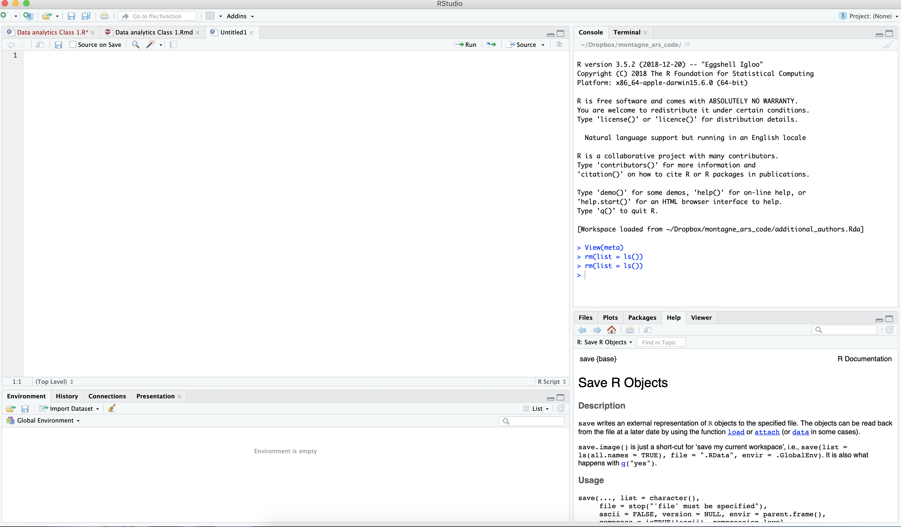
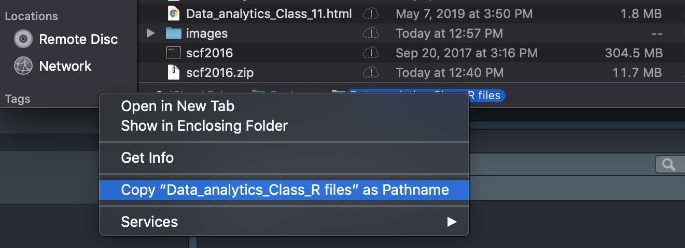
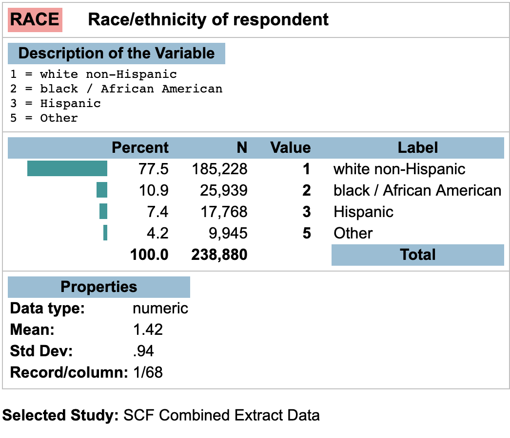
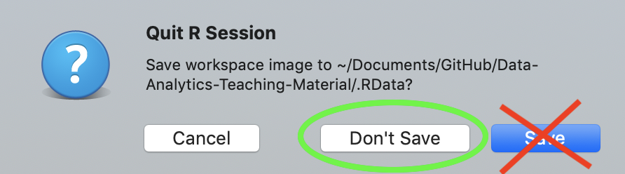

```{r setup, include=FALSE}
knitr::opts_chunk$set(echo = TRUE)
```

## Today we are going to cover the following topics:

- R Basics
- Reading data into R
- Mean, median, mode
- Standard deviation
- Interquartile range
- Weights
- Tables
- Histograms
- Creating new variables

## 1. Running R and RStudio
We will need R and RStudio. R is the program that will be running our code, RStudio is an interface ("integrated development environment or IDE") for writing our scripts and seeing our data.

Get and install the most recent version of R at: https://cran.rstudio.com/

Then get and install RStudio at: https://www.rstudio.com/products/rstudio/download/#download

Mac users, update XQuartz at: https://www.xquartz.org/


## Familiarizing yourself with R



## Some notes:
- The hashtag and green text indicates comments. These have no impact on the program
- You can run a line where your cursor is blinking with ctrl-enter (Mac: command + enter)
- You can run everything in a document by highlighting all lines and typing ctrl-enter (Mac: command + enter)

## Setting a work directory
We need to tell R where to find our data and where to save our data. This is called our work directory.

R sets a location by default. We can see where R had set the work directory with the following:
```{r }
getwd()
```

## Setting a work directory
On Apple:



## Setting a work directory
When I paste this info into R. At first, I get:
```{r, eval=F}
/Users/dmontagne/Desktop/Data_analytics_Class_R files/data
```
But I want to put that info into the *setwd* function. The path name should be in quotes, and all backslashes need to be forward slashes.

```{r, eval=F}
setwd("~/Desktop/Data Analytics for Business/data")
```

```{r, include=FALSE}
knitr::opts_knit$set(root.dir = "~/Documents/GitHub/Data-Analytics-Teaching-Material")
```


## Reading the data into R
Now that we know where the data is, we will want to read it into R.

The SFC file is a *sas7bdat* file. R  cannot natively read this file, but we can get tools to do this. The following function installs a package for reading this file:

```{r, eval=F }
install.packages("haven")
```

## Reading the data into R
The *haven* package has a function for reading our dataset. Although we have it installed, whenever we want to use it, we need to tell R to load it. To do this, we will use the library function.
```{r }
library(haven)
```

## Reading the data into R
Finally, we can now read the dataset into R with *haven*'s *read_sas* function. Since we have already set our work directory, we just need to tell R the name of the file, and assign this dataset a name within R.

```{r }
scf <- read_dta("rscfp2016.dta")
```

## Let's take a quick break
We have now done something that we will want to be run every time we start class. We can save what we've written so far so that we never have to do the above steps again. Yay!

If interested, you can manually browse the dataset with R's *View* function.

```{r, eval=F}
View(scf)
```

## Browsing the data
It's often easier to tell R to just show us a few lines of data.

```{r, eval=T}
head(scf)
```

## Browsing the data
It's even more convenient to look at just a few lines of a particular variable. Let's start with net worth. We will want to use R's dollar sign ($) syntax for referencing a variable within the scf dataset.

```{r, eval=T}
head(scf$networth)
```

## Browsing the data
We discussed in class how there are discrete and continuous variables. R uses a slightly different language for classifying variables, but the logic is similar. Which type of variable is net worth?

```{r, eval=T}
class(scf$networth)
```

## Good Coding Practice

R is case sensitive, so it is often easiest to keep variable names and other objects all lowercase. Please run the following in your class code

```{r, echo=T, results='hide',message=FALSE}
#3) Make life easier by making all variable names in lower case
  #a) Assign the variable names of scf to a new object "VarNames"
    var_names<-names(scf)
  #b) Look at the first few variable names
    head(var_names)
  #c) make a new object "NewNames" consisting of VarNames in lower case
    new_names<-tolower(var_names)
  #d) Look at the first few variable names of this object
    head(new_names)
  #e) Replace the variable names in the scf with NewNames 
    names(scf)<-new_names
```

## Summary statistics
Let's get some summary statistics on the age of our sample

```{r, eval=T}
mean(scf$age)
median(scf$age)
sd(scf$age)
```

## Standard deviation
What would it mean if the standard deviation on age was higher?

## Standard deviation
Let's compare rolling two standard 6-sided dies (D6) vs one 12-sided die (D12)

```{r, eval=T, echo=F}
set.seed(100)
D6<-1:6
D12<-1:12
n=500
D6Rolls<-sample(D6,n,replace=T)+sample(D6,n,replace=T)
D12Rolls<-sample(D12,n,replace=T)
hist(D6Rolls,breaks=0:12)
```

## Standard deviation
Let's compare rolling two standard 6-sided dies (D6) vs one 12-sided die (D12)

```{r, eval=T, echo=F}
set.seed(100)
D6<-1:6
D12<-1:12
n=500
D6Rolls<-sample(D6,n,replace=T)+sample(D6,n,replace=T)
D12Rolls<-sample(D12,n,replace=T)
hist(D12Rolls,breaks=0:12)
```

## Interquartile range
```{r, eval=T}
summary(scf$age)
```


## Survey weights
The SCF oversamples the rich, so unweighted estimates are not representative of national trends
```{r, eval=T}
mean(scf$income)
```

Instead we need to calculate the mean using survey weights. Luckily, R can do this for us with this simple function:
```{r, eval = T}
weighted.mean(scf$income,scf$wgt)
```

## Exercise
Estimate the mean and weighted mean of any one variable in the SCF


## Visualizing data
Let's generate a table of number of kids in the scf
```{r, eval=T}
table(scf$kids)
```

## Visualizing data
Now let's visualize this as a histogram
```{r, eval=T}
hist(scf$kids)
```

## Making new variables
Let's look at a table of race in the scf.
```{r, eval=T}
table(scf$race)
```

## Making new variables
What do these categories mean? As you go along in this class (and possibly as future data analysts), you will need to reference your data's codebook:



## Making new variables
Let's make a new variable for whether someone is white with the *ifelse* function.
```{r, eval=T}
scf$white<-ifelse(scf$race==1,1,0)
table(scf$white)
```

## Making new variables
We could also make race new race variable with the same logic.
```{r, eval=T}
scf$race2<-ifelse(scf$race==1,"White",
           ifelse(scf$race==2,"Black",
           ifelse(scf$race==3,"Latino",
           "Other")))
table(scf$race2)
```


## When closing RStudio, save changes to your code, but not to the data!

 


## Due next week
- Identify 10 asset and debt variables you think look interesting (use the SDA tool to look at the options)
- Clean and recode the variables so you can use them; run univariate statistics on the variables.


