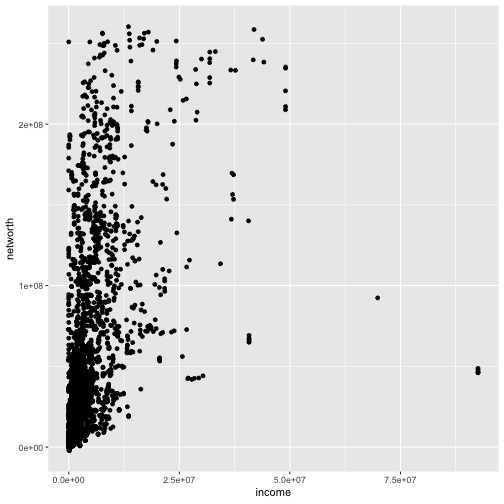
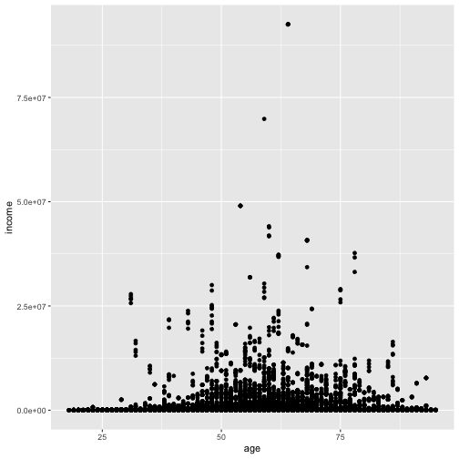
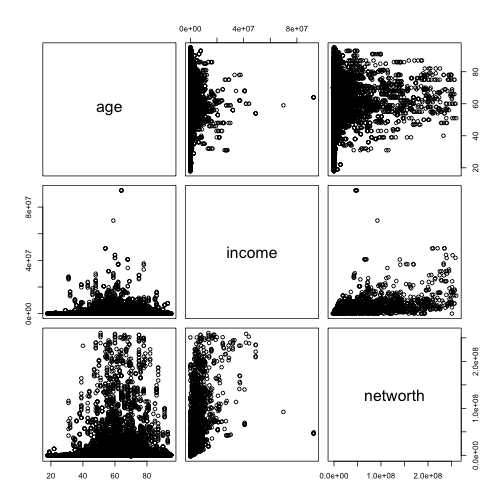
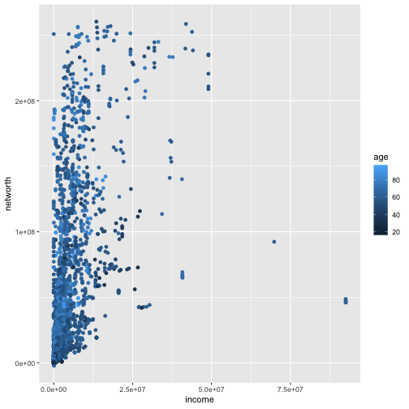
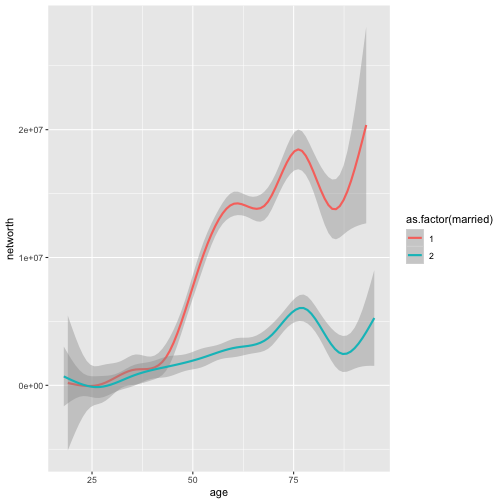

<style>


.reveal section p {
  color: black;
  font-size: .7em;
  font-family: 'Helvetica'; #this is the font/color of text in slides
}


.section .reveal .state-background {
    background: white;}
.section .reveal h1,
.section .reveal p {
    color: black;
    position: relative;
    top: 4%;}


.wrap-url pre code {
  word-wrap:break-word;
}

</style>


Multivariate Statistics
========================================================
autosize: true
transition: fade
  github: https://github.com/dmontagne
  

Agenda
========================================================
- Multivariate frequency tables
- Multivariate descriptive statistics
- Scatter plot matrices
- Other multivariate plots


  
Prepare R Session
========================================================
- Same steps as before:
  + Set working directory
  + Load libraries
  + Read in data
  + Create convienent functions 


Prepare R Session
========================================================
Set the work directory

```r
#EDIT
   setwd( "~/Documents/GitHub/Data-Analytics-Teaching-Material/") 
```

Prepare R Session
========================================================

Do the other things

```r
# load libraries
    library(haven)
    library(tidyverse)
    library(Hmisc)
    library(ggplot2)
# read data
    scf <- read_dta("rscfp2016.dta")
# lower case variable names
    names(scf)<-tolower(names(scf))
# create convenient functions
    weighted.median<-function(var,weight) {as.numeric(wtd.quantile(var, weight,.5))}
weighted.sd<-function(var,weight) {sqrt(wtd.var(var,weight))}
```


Create New Variables
========================================================
For simplicity, let's create a variable for age that bins people into different age _groups_

```r
# Age categories
scf <- scf %>% 
  mutate(age.cat = ifelse(scf$age>60,"60+",
                 ifelse(scf$age>=45,"45-60",
                 ifelse(scf$age>=30,"30-45",
                 "18-30"))))
    table(scf$age.cat)
```

```

18-30 30-45 45-60   60+ 
 2810  7340 10660 10430 
```

Create New Variables
========================================================
Repeat rounding steps

```r
# Number of kids
scf <- scf %>% 
  mutate(kids = round(kids))
table(scf$kids)
```

```

    0     1     2     3     4     5     6     7 
18215  5495  4595  2060   640   175    40    20 
```

Create New Variables
========================================================

```r
scf <- scf %>% 
  mutate(race_labs = ifelse(scf$race == 1, "White",
                 ifelse(scf$race == 2,"Black",
                 ifelse(scf$race == 3,"Hispanic",
                 "Other"))),
         white = ifelse(race == 1, 1, 0))
```

Create New Variables
========================================================

```r
table(scf$race_labs)
```

```

   Black Hispanic    Other    White 
    4177     3059     1603    22401 
```

```r
table(scf$white)
```

```

    0     1 
 8839 22401 
```

More Involved Variable Creation
========================================================
How can we see who is in the top 1% of wealth?


```r
# What number represents the cuttoff for the top 1%:
quantile(scf$networth, 0.99)
```

```
      99% 
260731135 
```

```r
# Use above to create binary variable of who is in the top 1%:
scf <- scf %>% 
  mutate(top1 = ifelse(networth >= quantile(scf$networth, 0.99), 1, 0))
```

More Involved Variable Creation
========================================================
How can we see who is in the top 1% of wealth?


```r
table(scf$top1)
```

```

    0     1 
30927   313 
```


Bivariate Frequency Tables
========================================================

For better legibility, we assign the frequency table to temp1, use temp to get a table of proportions (which we assign to temp2), and print the rounded results.

```r
#Age by number kids
    temp1<-table(scf$age.cat, scf$kids)
    temp2<-prop.table(temp1, 1)
    round(100*temp2)
```

```
       
         0  1  2  3  4  5  6  7
  18-30 65 16 11  6  2  1  0  0
  30-45 33 20 27 14  5  1  0  0
  45-60 48 23 19  8  2  1  0  0
  60+   85 12  2  1  0  0  0  0
```

Multivariate frequency table
========================================================
Counts, not proportion:

```r
table(scf$age.cat[scf$top1==0],scf$kids[scf$top1==0])
```

```
       
           0    1    2    3    4    5    6    7
  18-30 1830  440  310  155   55   15    5    0
  30-45 2405 1450 1970 1011  350  105   20   20
  45-60 5059 2390 2032  800  221   55   15    0
  60+   8719 1190  235   60   10    0    0    0
```

Multivariate frequency table
========================================================
Counts, not proportion:

```r
table(scf$age.cat[scf$top1==1],scf$kids[scf$top1==1])
```

```
       
          0   1   2   3   4
  30-45   0   0   0   9   0
  45-60  26  15  23  20   4
  60+   176  10  25   5   0
```

Multivariate frequency table
========================================================

Proportions 


```r
round(100*prop.table(table(scf$age.cat[scf$top1==0],
                           scf$kids[scf$top1==0]),1))
```

```
       
         0  1  2  3  4  5  6  7
  18-30 65 16 11  6  2  1  0  0
  30-45 33 20 27 14  5  1  0  0
  45-60 48 23 19  8  2  1  0  0
  60+   85 12  2  1  0  0  0  0
```

Multivariate frequency table
========================================================

Proportions 


```r
round(100*prop.table(table(scf$age.cat[scf$top1==1],
                           scf$kids[scf$top1==1]),1))
```

```
       
          0   1   2   3   4
  30-45   0   0   0 100   0
  45-60  30  17  26  23   5
  60+    81   5  12   2   0
```

Multivariate frequency table
========================================================

Proportions 


```r
round(100*prop.table(table(scf$age.cat[scf$top1==0],
                           scf$kids[scf$top1==0]),1))
round(100*prop.table(table(scf$age.cat[scf$top1==1],
                           scf$kids[scf$top1==1]),1))
```


Multivariate frequency table
========================================================

Proportions 


```r
round(100*prop.table(table(scf$age.cat[scf$top1==0],
                           scf$kids[scf$top1==0]),1))
round(100*prop.table(table(scf$age.cat[scf$top1==1],
                           scf$kids[scf$top1==1]),1))
```
- This code is not easily readable.

Multivariate frequency table
========================================================

Proportions 


```r
temp1<-table(scf$age.cat[scf$top1==0],scf$kids[scf$top1==0])
temp2<-prop.table(temp1, 1)
round(100*temp2)
```

```
       
         0  1  2  3  4  5  6  7
  18-30 65 16 11  6  2  1  0  0
  30-45 33 20 27 14  5  1  0  0
  45-60 48 23 19  8  2  1  0  0
  60+   85 12  2  1  0  0  0  0
```

Other Multivariate Information
=======================================================
**What do you want to show?**

- What are our variables of interest?
    - "married", "kids", "age", "race"
    
- What statistics do we want?
    - Mean, Median, SD
    
- What do we want to stratify these by?
    - Wealth Percentile

Prepare Table
=======================================================

Prepare Table
=======================================================
i.e. back to data wrangling

Prepare Table
=======================================================
There are a few different ways to arrange summary tables

Prepare Table
=======================================================
There are a few different ways to arrange summary tables

1. You can fill in each value by hand using indexing

Prepare Table
=======================================================


```r
df99 <- data.frame(
      Variable=c("married","kids","age","white"),
      Mean=NA,
      Median=NA,
      SD=NA)
df99$Mean[1]<-weighted.mean(scf99$married,scf99$wgt)
df99$Mean[2]<-weighted.mean(scf99$kids,scf99$wgt)
df99$Mean[3]<-weighted.mean(scf99$age,scf99$wgt)
df99$Mean[4]<-weighted.mean(scf99$white,scf99$wgt)
df99$Median[1]<-weighted.median(scf99$married,scf99$wgt)
df99$Median[2]<-weighted.median(scf99$kids,scf99$wgt)
df99$Median[3]<-weighted.median(scf99$age,scf99$wgt)
df99$Median[4]<-weighted.median(scf99$white,scf99$wgt)
df99$SD[1]<-weighted.sd(scf99$married,scf99$wgt)
df99$SD[2]<-weighted.sd(scf99$kids,scf99$wgt)
df99$SD[3]<-weighted.sd(scf99$age,scf99$wgt)
df99$SD[4]<-weighted.sd(scf99$white,scf99$wgt)
df99$Mean<-round(df99$Mean,2)
df99$SD<-round(df99$SD,2)
```

Prepare Table
=======================================================
There are a few different ways to arrange summary tables

1. You can fill in each value by hand using indexing

2. You can use an `for` loop

Prepare Table
=======================================================


```r
df99 <- data.frame(
      Variable=c("married","kids","age","white"),
      Mean=NA,
      Median=NA,
      SD=NA)
for(i in 1:nrow(df99)){
    df99$Mean[i]<-weighted.mean(scf99[,df99$Variable[i]],scf99$wgt)
    df99$Median[i]<-weighted.median(scf99[,df99$Variable[i]],scf99$wgt)
    df99$SD[i]<-weighted.sd(scf99[,df99$Variable[i]],scf99$wgt)
}
df99$Mean<-round(df99$Mean,2)
df99$SD<-round(df99$SD,2)
df99
```

Prepare Table
=======================================================
There are a few different ways to arrange summary tables

1. You can fill in each value by hand using indexing

2. You can use an `for` loop

3. You can use the ~magic~ of the tidyverse

Prepare Table
=======================================================
We will be using the `dplyr` package

Prepare Table
=======================================================
We will be using the `dplyr` package
- First we want to stratify by wealth percentiles, so we subset our data


```r
scf99<-scf[scf$top1==0,]

scf1<-scf[scf$top1==1,]
```

Prepare Table
=======================================================
We will be using `dplyr`
- First we want to stratify by wealth percentiles, so we subset our data
- Next, we summarize

Prepare Table
=======================================================


```r
# The bottom 99% of wealth owners:
bottom99_summary <- scf99 %>% select(married, kids, age) %>% 
  summarise_all(list(mean = mean, median = median, sd = sd)) %>% 
  gather(variable) %>% 
  separate(variable, into = c("var", "statistic"), sep = "_") %>% 
  spread(statistic, value)
bottom99_summary
```

```
# A tibble: 3 x 4
  var       mean median     sd
  <chr>    <dbl>  <dbl>  <dbl>
1 age     52.6       53 16.2  
2 kids     0.790      0  1.13 
3 married  1.38       1  0.485
```

Prepare Table
=======================================================

```r
# The top 1% of wealth owners:
top1_summary <- scf1 %>% select(married, kids, age) %>% 
  summarise_all(list(mean = mean, median = median, sd = sd)) %>% 
  gather(variable) %>% 
  separate(variable, into = c("var", "statistic"), sep = "_") %>% 
  spread(statistic, value)
top1_summary
```

```
# A tibble: 3 x 4
  var       mean median     sd
  <chr>    <dbl>  <dbl>  <dbl>
1 age     66.1       66 10.8  
2 kids     0.764      0  1.14 
3 married  1.16       1  0.367
```

Scatter Plot
=======================================================

```r
ggplot(data = scf99,aes(x=income,y=networth))+ geom_point()
```



Scatter Plot
=======================================================

```r
ggplot(data = scf99,aes(x=age,y=income))+ geom_point()
```


    
Scatter Plot Matrix
=======================================================

```r
pairs(scf99[,c("age","income","networth")])
```


   
Other Multivariate Plots
=======================================================

```r
ggplot(data = scf99,aes(x=income,y=networth,color=age)) +
  geom_point()
```



Other Multivariate Plots
=======================================================

```r
ggplot(data=scf99,aes(x=age,y=networth,color=as.factor(married))) + 
  geom_smooth()
```


