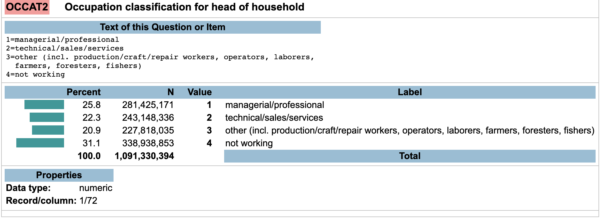

<style>


.reveal section p {
  color: black;
  font-size: .7em;
  font-family: 'Helvetica'; #this is the font/color of text in slides
}


.section .reveal .state-background {
    background: white;}
.section .reveal h1,
.section .reveal p {
    color: black;
    position: relative;
    top: 4%;}


.wrap-url pre code {
  word-wrap:break-word;
}

</style>


Introduction to Linear Models
========================================================
autosize: true
transition: fade
  follow along with code: https://dmontagne.github.io/Data-Analytics-Teaching-Material/intro_linear_models_code.R


Agenda
========================================================
- OLS 
- Hypothesis testing
- Data mining
- Decision analysis


  
Prepare Data
========================================================
- As always...
- Set the working directory

```r
#EDIT
   setwd("~/Documents/GitHub/Data-Analytics-Teaching-Material/") 
```

Prepare data
========================================================
Run all of these lines

```r
# libraries
    library(haven)
    library(tidyverse)
    library(Hmisc)
    library(ggplot2)
# read data
  scf <- read_dta("rscfp2016.dta")
# lower case variable names
  names(scf)<-tolower(names(scf))
# create convenient functions
  weighted.median <- function(var,weight) {as.numeric(wtd.quantile(var, weight,.5))}
  weighted.sd<-function(var,weight) {sqrt(wtd.var(var,weight))}
```


Identify Question
========================================================
Do professionals and managers buy more cars?


Identify Variables
========================================================
- Dependent = Number cars owned
- Independent = Professional occupation

Identify Variables
========================================================
Find variable names and value meanings


Identify Variables
========================================================
Find variable names and value meanings


Identify Variables
========================================================
It is not obvious what `NVEHIC` means, so let's rename


```r
scf <- scf %>% rename(number_cars = nvehic)
```

Get a Sense for Distribution
========================================================

```r
table(scf$occat2)
```

```

    1     2     3     4 
11320  6141  4704  9075 
```

```r
table(scf$number_cars)
```

```

    0     1     2     3     4     5     6     7     8     9    10 
 3320  9803 10580  4617  1635   700   280   120    70    30    85 
```

Always Back to Data Wrangling
========================================================

Always Back to Data Wrangling
========================================================
We need to make a binary variable of whether or not the respondent has a professional or managerial job

Always Back to Data Wrangling
========================================================
We need to make a binary variable of whether or not the respondent has a professional or managerial job


```r
scf <- scf %>%
  mutate(prof = ifelse(occat2==1,1,0))

scf <- scf %>%
  mutate(number_cars = round(number_cars),
         white = ifelse(race == 1, 1, 0))
```

Look at Bivariate Descriptives
========================================================

```r
weighted.mean(scf$number_cars[scf$prof==1], scf$wgt[scf$prof==1])
```

```
[1] 1.836962
```

```r
weighted.mean(scf$number_cars[scf$prof==0], scf$wgt[scf$prof==0])
```

```
[1] 1.604994
```

Bivariate Models
========================================================
Is the difference between professionals and non-professionals real?

```r
summary(glm(number_cars ~ prof, data=scf, weights=wgt))$coefficients
```

```
             Estimate  Std. Error   t value     Pr(>|t|)
(Intercept) 1.6049944 0.007389846 217.18915 0.000000e+00
prof        0.2319673 0.013875736  16.71748 1.828032e-62
```

Any Confounders?
========================================================

```r
table(scf$kids)
```

```

    0     1     2     3     4     5     6     7 
18215  5495  4595  2060   640   175    40    20 
```

```r
cor(scf$kids,scf$number_cars)
```

```
[1] 0.1504769
```

```r
cor(scf$kids,scf$prof)
```

```
[1] 0.05700537
```

Multivariate Model
========================================================

```r
summary(glm(number_cars ~ prof + kids, data=scf,weights=wgt))$coefficients
```

```
             Estimate  Std. Error   t value      Pr(>|t|)
(Intercept) 1.4669169 0.008261459 177.56147  0.000000e+00
prof        0.2008174 0.013642912  14.71954  7.043390e-49
kids        0.1926790 0.005526643  34.86365 2.730549e-261
```

Why are Estimates Different for the Same Variable?
========================================================

```r
summary(glm(number_cars ~ prof, data=scf,weights=wgt))$coefficient
```

```
             Estimate  Std. Error   t value     Pr(>|t|)
(Intercept) 1.6049944 0.007389846 217.18915 0.000000e+00
prof        0.2319673 0.013875736  16.71748 1.828032e-62
```

```r
summary(glm(number_cars ~ prof + kids, data=scf,weights=wgt))$coefficient
```

```
             Estimate  Std. Error   t value      Pr(>|t|)
(Intercept) 1.4669169 0.008261459 177.56147  0.000000e+00
prof        0.2008174 0.013642912  14.71954  7.043390e-49
kids        0.1926790 0.005526643  34.86365 2.730549e-261
```

Other Confounders
========================================================
Age?

```r
summary(glm(number_cars ~ prof + kids + age, data=scf,weights=wgt))$coefficients
```

```
               Estimate  Std. Error  t value     Pr(>|t|)
(Intercept) 1.032242825 0.023077267 44.72986 0.000000e+00
prof        0.248667021 0.013761642 18.06957 1.298019e-72
kids        0.229979270 0.005794666 39.68810 0.000000e+00
age         0.007598019 0.000377006 20.15357 9.330079e-90
```

Other Confounders
========================================================
Education?

```r
table(scf$edcl)
```

```

    1     2     3     4 
 3267  6809  7679 13485 
```

```r
scf$edcl<-round(scf$edcl)
```

Other Confounders
========================================================
Uh oh...

```r
summary(glm(number_cars ~ prof + kids + age + edcl, data=scf,weights=wgt))$coefficients
```

```
               Estimate  Std. Error  t value      Pr(>|t|)
(Intercept) 0.794133763 0.028732804 27.63858 3.838829e-166
prof        0.160956870 0.015113977 10.64954  1.945367e-26
kids        0.236620943 0.005797001 40.81782  0.000000e+00
age         0.007681704 0.000375911 20.43490  3.286421e-92
edcl        0.089702234 0.006484093 13.83420  2.128791e-43
```

Categorical variables
========================================================
- Convert to a "factor"

```r
scf$edcl <- factor(scf$edcl)
summary(glm(number_cars ~ prof + kids + age + edcl, data=scf,weights=wgt))$coefficients
```

```
               Estimate   Std. Error  t value      Pr(>|t|)
(Intercept) 0.760857352 0.0289001922 26.32707 4.202186e-151
prof        0.173522106 0.0154148081 11.25685  2.440921e-29
kids        0.238632460 0.0057971909 41.16346  0.000000e+00
age         0.007833532 0.0003786453 20.68831  1.900357e-94
edcl2       0.289909142 0.0208642395 13.89503  9.167500e-44
edcl3       0.279258608 0.0209239932 13.34633  1.606975e-40
edcl4       0.359515988 0.0214816783 16.73594  1.344864e-62
```

Full Model
========================================================

```r
summary(glm(number_cars ~ prof + kids + age + edcl + married + hhsex + white + turndown, data=scf,weights=wgt))$coefficients
```

```
                Estimate   Std. Error    t value      Pr(>|t|)
(Intercept)  2.383753086 0.0319477096  74.614209  0.000000e+00
prof         0.152964782 0.0135447035  11.293328  1.615324e-29
kids         0.150492191 0.0053412207  28.175617 1.682422e-172
age          0.006417377 0.0003420712  18.760355  4.287293e-78
edcl2        0.212597400 0.0185323498  11.471692  2.106261e-30
edcl3        0.269679766 0.0185995449  14.499267  1.747369e-47
edcl4        0.214835106 0.0191868237  11.197013  4.790590e-29
married     -0.848405605 0.0151504702 -55.998632  0.000000e+00
hhsex       -0.261914563 0.0163919618 -15.978232  3.057314e-57
white        0.208549986 0.0120894483  17.250579  2.251477e-66
turndown     0.026352552 0.0174652421   1.508857  1.313455e-01
```


Making Predictions (Decision analysis)
========================================================
Let's use a simple model.

```r
m1 <- glm(number_cars ~ prof + kids, data=scf,weights=wgt)
```

Making Predictions
========================================================
How many cars might we expect a non-professional with 1 kid to own?

```r
to.predict<-data.frame(prof=0,
                       kids=1
                       )
predict(m1,to.predict)
```

```
       1 
1.659596 
```

Making Predictions
========================================================
How many cars might we expect a professional  with 5 kids to own?

```r
to.predict<-data.frame(prof=1,
                       kids=5
)
predict(m1,to.predict)
```

```
       1 
2.631129 
```

Visualizing Predictions
========================================================
What if we want to know how many cars professionals and non professionals with 0-5 kids own?

```r
to.predict<-data.frame(prof=c(0,0,0,0,0,0,1,1,1,1,1,1),
                       kids=c(0,1,2,3,4,5,0,1,2,3,4,5)
)
```

Visualizing Predictions
========================================================

```r
    num.car <- predict(m1,to.predict)
    vizdf <- cbind(to.predict,num.car)
    vizdf
```

```
   prof kids  num.car
1     0    0 1.466917
2     0    1 1.659596
3     0    2 1.852275
4     0    3 2.044954
5     0    4 2.237633
6     0    5 2.430312
7     1    0 1.667734
8     1    1 1.860413
9     1    2 2.053092
10    1    3 2.245771
11    1    4 2.438450
12    1    5 2.631129
```

Visualizing Predictions
========================================================
Plotting

```r
ggplot(data = vizdf, aes(x = kids, y = num.car, color = factor(prof))) +
      geom_line()
```


Visualizing Predictions
========================================================
Lets make the graph look better


Visualizing OLS models
========================================================

```r
    ggplot(data=scf,
           aes(x = prof, y = number_cars, weight = wgt))+
          geom_smooth(method = "glm")
```


Visualizing OLS models
========================================================

```r
ggplot(data=scf,
       aes(x = kids, y = number_cars, weight = wgt, color = factor(prof)))+
          geom_smooth(method = "glm")
```


Visualizing OLS models
========================================================
Prettier version

