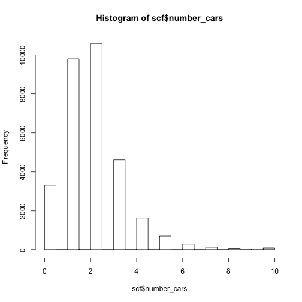
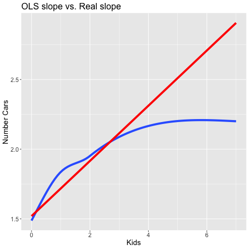

<style>


.reveal section p {
  color: black;
  font-size: .7em;
  font-family: 'Helvetica'; #this is the font/color of text in slides
}


.section .reveal .state-background {
    background: white;}
.section .reveal h1,
.section .reveal p {
    color: black;
    position: relative;
    top: 4%;}


.wrap-url pre code {
  word-wrap:break-word;
}

</style>


Non-linear Models
========================================================
autosize: true
transition: fade
  github: https://github.com/dmontagne


Agenda
========================================================
- Logistic Regression 
- Poisson Regression


  
Prepare data
========================================================
As always:

- Set the working directory
- Run all the library commands
- Run the data editing commands


Identify variables
========================================================
Dependent variables:

- Number of cars owned or leased (`number_cars`)

- Own any cars (`owncar`)

Independent variables:

- Number kids (`kids`)

- Does not own checking account (`nochk`)

Try OLS for owncar
========================================================

```r
summary(glm(owncar ~ kids+nochk, data=scf, weights=wgt))$coefficient
```

```
               Estimate  Std. Error   t value     Pr(>|t|)
(Intercept)  0.85446744 0.002438663 350.38363 0.000000e+00
kids         0.02532221 0.001772736  14.28425 3.835015e-46
nochk       -0.31485278 0.007175937 -43.87619 0.000000e+00
```

Logit for owncar
========================================================

```r
summary(glm(owncar ~ kids+nochk, data=scf, family=binomial(link='logit'), 
            weights=wgt/mean(wgt)))$coefficient
```

```
              Estimate Std. Error   z value    Pr(>|z|)
(Intercept)  1.7820986 0.02002190  89.00748 0.00000e+00
kids         0.2288317 0.01646175  13.90081 6.26276e-44
nochk       -1.7422508 0.04434568 -39.28794 0.00000e+00
```

Distribution of Cars Owned or Leased
========================================================

```r
hist(scf$number_cars, right=F)
```



Try OLS for Cars Owned or Leased
========================================================

```r
summary(glm(number_cars ~ kids+nochk, data=scf,weights=wgt))$coefficient
```

```
              Estimate  Std. Error   t value Pr(>|t|)
(Intercept)  1.5837220 0.007424692 213.30475        0
kids         0.2126355 0.005397228  39.39717        0
nochk       -0.9115660 0.021847680 -41.72370        0
```

Poisson for Cars Owned or Leased
========================================================

```r
summary(glm(number_cars ~ kids+nochk, data=scf, family="poisson",
            weights=wgt/mean(wgt)))$coefficient
```

```
              Estimate  Std. Error   z value      Pr(>|z|)
(Intercept)  0.4591887 0.005517516  83.22381  0.000000e+00
kids         0.1170030 0.003604504  32.46022 3.885826e-231
nochk       -0.7102765 0.021455490 -33.10465 2.547465e-240
```

Problematic Assumption of OLS
========================================================

